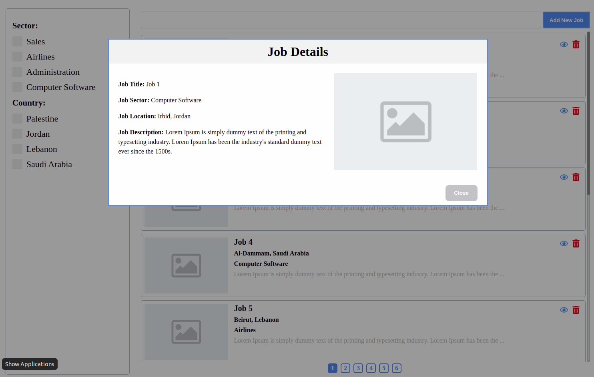
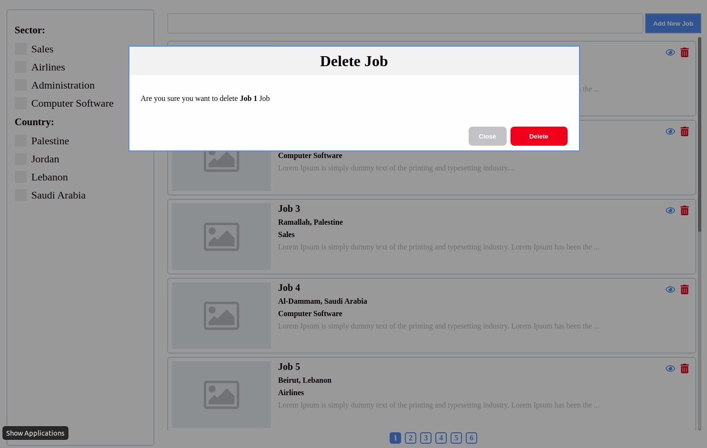
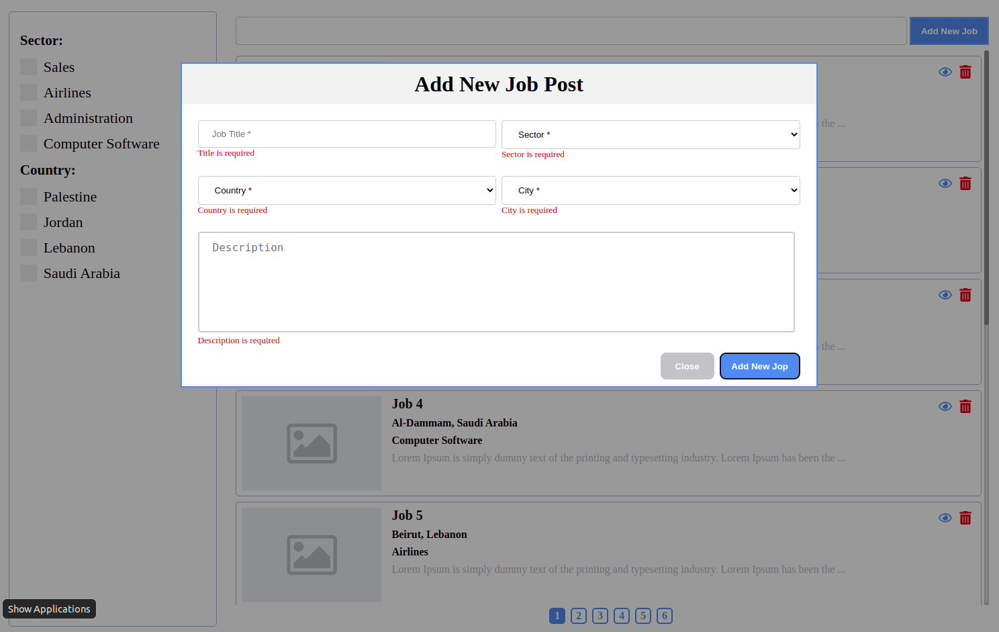
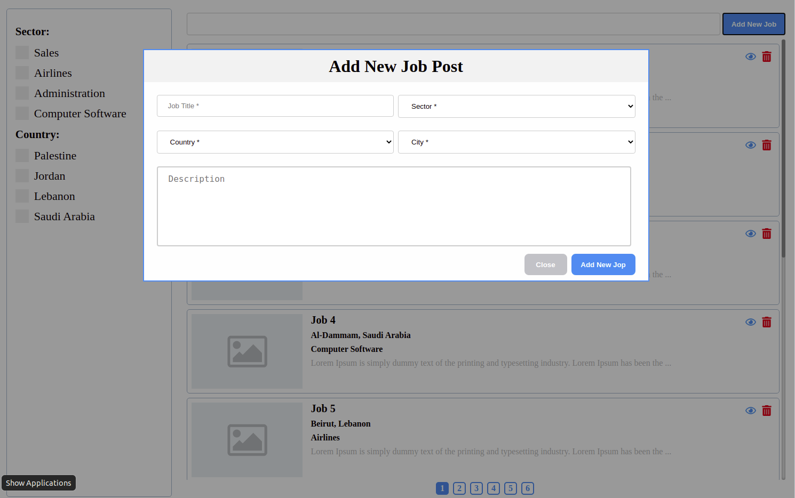
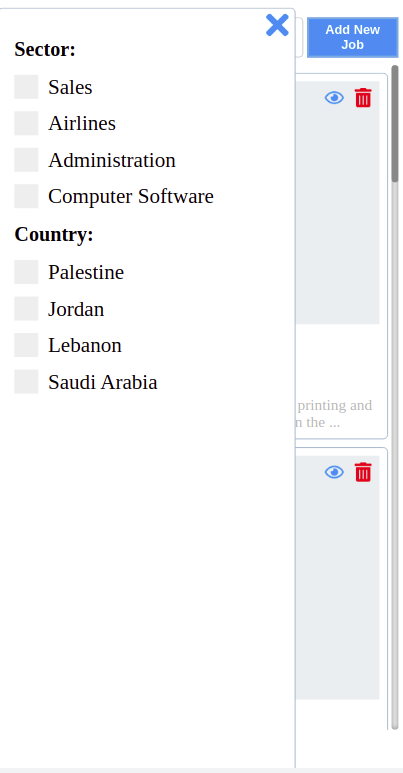
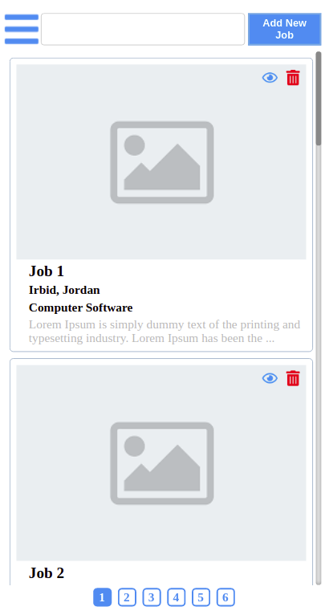
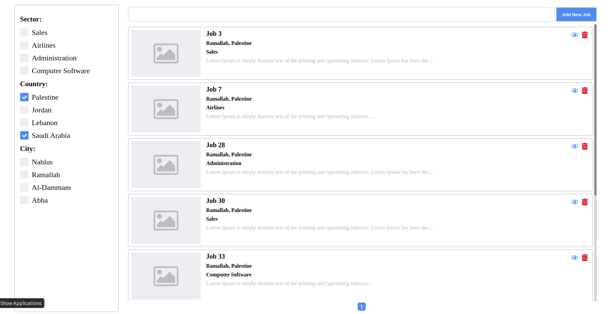
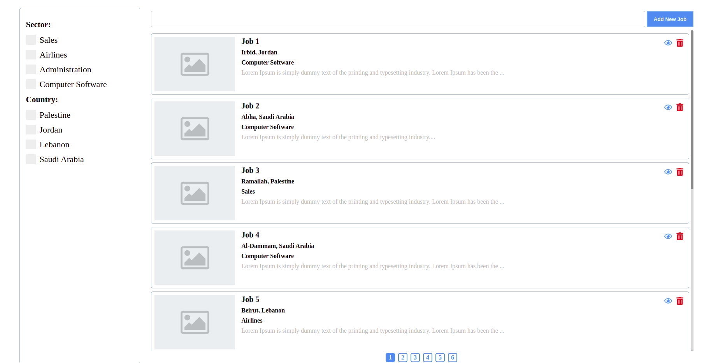

# Gadeer Future Task

build using nodejs and vanilla javascrip

[Demo](https://survey-maker-2020.herokuapp.com/)

## Installation

after cloning the repo

- npm install
- add PORT and DB_URL to environment variables
- `npm run start:dev` to start it locally
- open the browser on localhost:{PORT}

